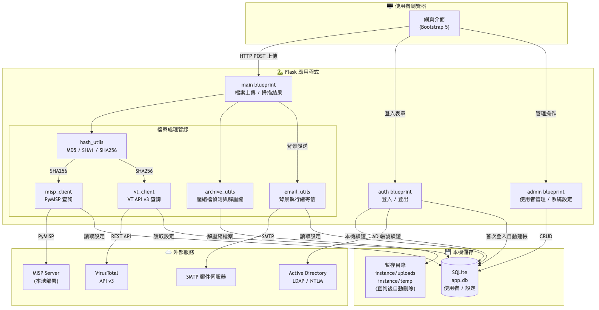
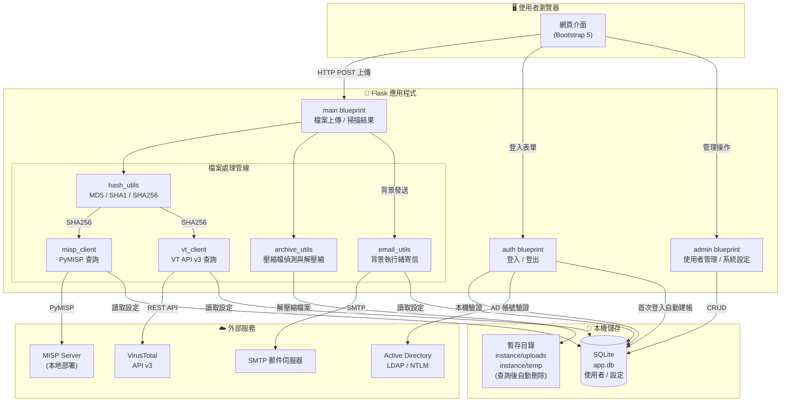
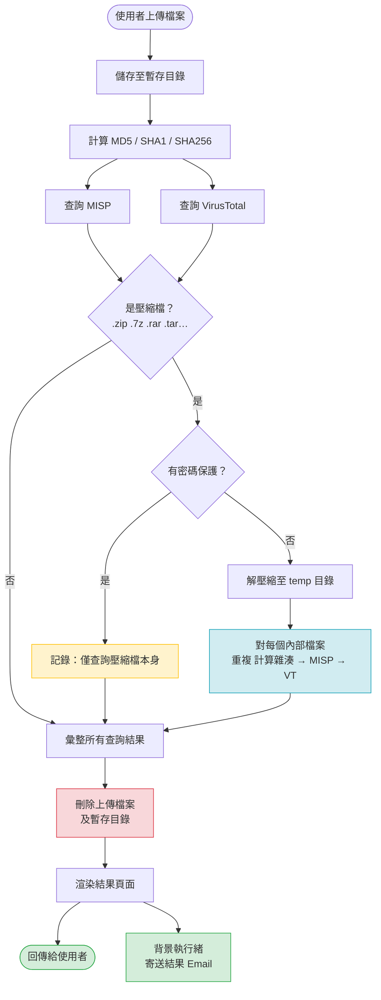
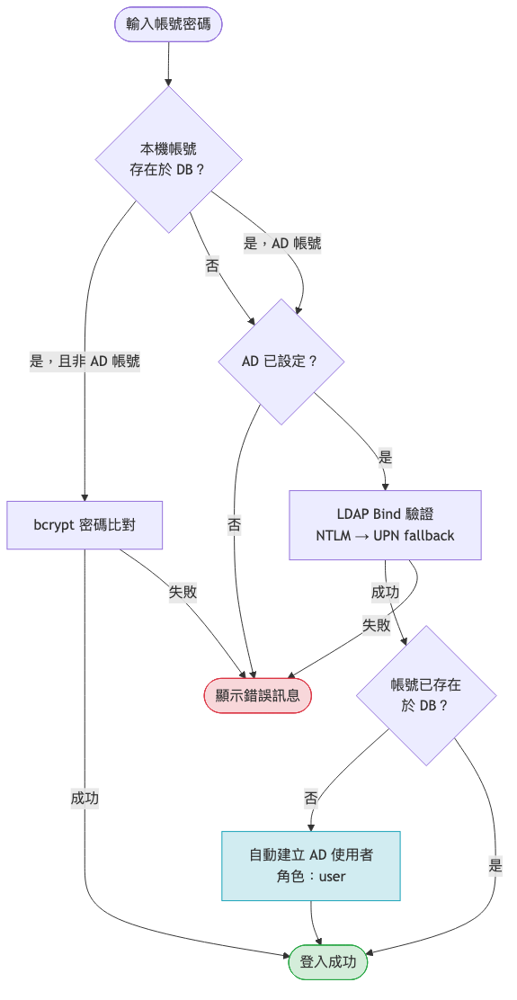
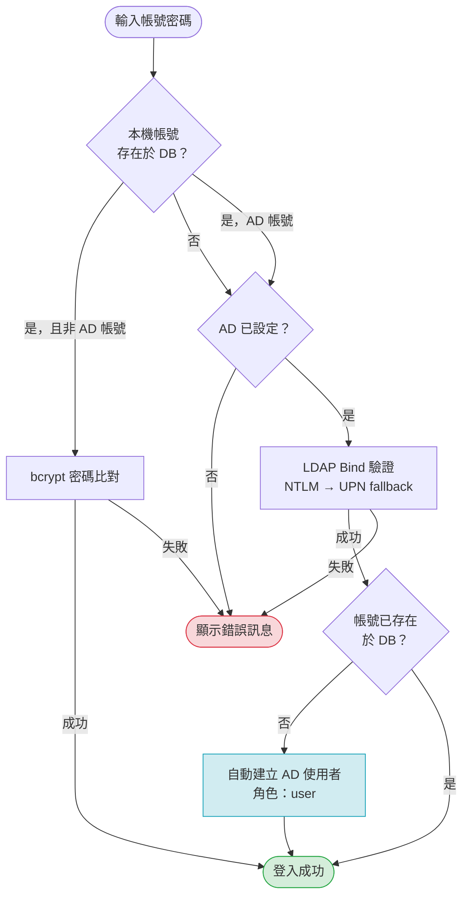

# Uploader4MISP

一套供資安團隊使用的檔案掃描平台。使用者上傳檔案後，系統自動計算雜湊值並比對 **MISP** 及 **VirusTotal**，結果即時顯示於網頁並寄送到使用者 Email。

---

## 系統架構

### 元件總覽



<details>
<summary>Mermaid 原始碼</summary>



</details>

### 檔案掃描流程


<details>
<summary>Mermaid 原始碼</summary>



</details>

### 認證流程



<details>
<summary>Mermaid 原始碼</summary>



</details>

---

## 功能特色

- **雜湊計算**：自動計算 MD5、SHA1、SHA256
- **壓縮檔處理**：支援 `.zip` `.7z` `.rar` `.tar` `.tar.gz` `.tar.bz2` 等格式，先查詢壓縮檔本身，若無密碼保護則解壓後逐一查詢內部檔案
- **MISP 整合**：透過 PyMISP 搜尋本地 MISP 是否有對應的威脅事件
- **VirusTotal 整合**：呼叫 VT API v3 查詢偵測比率
- **雙重認證**：本機帳號（SQLite + bcrypt）及 Active Directory（LDAP，支援 NTLM 及 UPN 兩種模式）
- **Email 通知**：每次掃描結果自動以背景執行緒寄送至登入帳號對應的 Email
- **帳號管理**：管理員可新增/編輯/刪除使用者，設定 Email 及角色
- **系統設定**：MISP、VirusTotal、SMTP、AD 等參數全部透過網頁介面設定，即時生效

---

## 準備事項

### 環境需求

| 項目 | 版本需求 |
|---|---|
| Python | 3.10 以上 |
| pip | 最新版 |
| 作業系統 | Linux / macOS / Windows |

### 外部服務

在開始安裝前，請確認已備妥下列資訊：

1. **MISP 伺服器**
   - 伺服器 URL（如 `https://misp.example.com`）
   - Automation Key（MISP → 右上角帳號 → Automation）

2. **VirusTotal API Key**
   - 免費帳號每日有 500 次查詢限額
   - 申請網址：https://www.virustotal.com/gui/join-us

3. **SMTP 郵件伺服器**（用於寄送掃描結果）
   - 伺服器位址、Port、帳號密碼
   - 若使用 Gmail，需開啟「應用程式密碼」

4. **Active Directory**（選用）
   - AD 伺服器位址
   - Base DN（如 `DC=example,DC=com`）
   - NetBIOS 網域名稱（如 `EXAMPLE`）
   - 服務帳號 DN 及密碼（用於 Bind 驗證）

### RAR 解壓縮依賴

`rarfile` 套件需要系統安裝 `unrar`：

```bash
# macOS
brew install rar

# Ubuntu / Debian
sudo apt install unrar

# CentOS / RHEL
sudo yum install unrar
```

---

## 安裝步驟

### 1. 取得程式碼

```bash
git clone https://github.com/ct9915/Uploader4MISP.git
cd Uploader4MISP
```

### 2. 建立虛擬環境（建議）

```bash
python3 -m venv venv
source venv/bin/activate        # Linux / macOS
# venv\Scripts\activate         # Windows
```

### 3. 安裝相依套件

```bash
pip install -r requirements.txt
```

### 4. 設定 Secret Key（正式環境必做）

建立 `.env` 檔案於專案根目錄：

```env
SECRET_KEY=your-random-secret-key-here
```

或直接設定環境變數：

```bash
export SECRET_KEY="your-random-secret-key-here"
```

> 若未設定，系統會使用預設值 `change-me-in-production`，**正式環境請務必更換**。

### 5. 啟動應用程式

```bash
python run.py
```

伺服器預設監聽 `http://0.0.0.0:5000`，首次啟動會自動建立 SQLite 資料庫及預設管理員帳號。

---

## 首次使用設定

### 1. 登入

開啟瀏覽器前往 `http://localhost:5000`，使用預設管理員帳號登入：

| 帳號 | 密碼 |
|---|---|
| `admin` | `admin` |

> **請立即至「使用者管理」修改預設密碼。**

### 2. 填入系統設定

登入後點選右上角 **系統設定**（`/admin/settings`），填入以下各項：

**MISP 設定**

| 欄位 | 說明 | 範例 |
|---|---|---|
| MISP 伺服器 URL | 含 https:// | `https://misp.example.com` |
| MISP API Key | Automation Key | `abc123...` |
| 驗證 SSL | 是否驗證憑證 | `true` / `false` |

**VirusTotal 設定**

| 欄位 | 說明 |
|---|---|
| VirusTotal API Key | 從 VT 帳號取得 |

**SMTP 郵件設定**

| 欄位 | 範例 |
|---|---|
| SMTP 伺服器 | `smtp.example.com` |
| SMTP 埠 | `25` / `465` / `587` |
| 使用 TLS | `true` / `false` |
| SMTP 帳號 | `sender@example.com` |
| SMTP 密碼 | xxxxxxxx |
| 寄件者地址 | `uploader4misp@example.com` |

**Active Directory 設定**（選用）

| 欄位 | 說明 | 範例 |
|---|---|---|
| AD 伺服器位址 | DC 主機名稱或 IP | `dc01.example.com` |
| AD Base DN | 搜尋根 | `DC=example,DC=com` |
| AD 網域 (NetBIOS) | 前置網域名 | `EXAMPLE` |
| AD Bind DN | 服務帳號完整 DN | `CN=svc,OU=Services,DC=example,DC=com` |
| AD Bind 密碼 | 服務帳號密碼 | |

### 3. 管理使用者

前往 **使用者管理**（`/admin/users`）：
- 新增本機帳號時填入帳號、密碼、Email、角色
- 新增 AD 帳號時勾選「AD 使用者」，**帳號名稱需與 AD 登入名稱（sAMAccountName）完全一致**，密碼欄位留空
- 每位使用者的 Email 為掃描結果寄送目的地，請確實填寫

---

## 使用流程

1. 登入系統
2. 點選「上傳檔案」，選擇或拖曳檔案
3. 系統自動處理：
   - 計算雜湊 → 查詢 MISP → 查詢 VirusTotal
   - 若為壓縮檔且無密碼：解壓縮後對每個內部檔案重複查詢
4. 結果頁面顯示每個檔案的 MISP 事件數及 VT 偵測比率
5. 同步將完整結果寄至登入帳號的 Email

---

## 注意事項

### 安全性

- **部署前請更換 `SECRET_KEY`**，使用隨機長字串
- **請立即修改預設 `admin` 密碼**
- 建議在內網或 VPN 後方部署，不建議直接對外開放
- MISP API Key 及 VT API Key 均儲存於本機 SQLite 資料庫（`instance/app.db`），請確保主機存取權限正確設定
- 若 MISP 使用自簽憑證，將 `MISP 驗證 SSL` 設為 `false`

### 上傳限制

- 單次上傳上限為 **500 MB**
- 上傳的檔案及解壓縮後的暫存檔在查詢完成後**立即刪除**，不會永久保留

### VirusTotal 免費額度

- 免費版 API 每分鐘 4 次、每日 500 次查詢
- 壓縮檔內含多個檔案時，每個內部檔案各計一次查詢
- 若超出額度，VT 查詢欄位會顯示 API 錯誤，不影響 MISP 查詢結果

### Active Directory

- 系統使用 NTLM（`DOMAIN\user`）為主、UPN（`user@domain`）為備的認證順序
- AD 使用者**首次登入時自動建立帳號**，角色預設為 `user`，Email 需由管理員事後填入
- AD 使用者的帳號名稱在系統中不可修改；密碼驗證完全交由 AD 處理

### RAR 格式

- 解壓縮 RAR 檔需要系統安裝 `unrar` 執行檔（詳見準備事項）
- 若未安裝，RAR 檔仍會查詢壓縮檔本身的雜湊，但不會嘗試解壓縮

---

## 更新架構圖

架構圖原始碼位於 `docs/diagrams/*.mmd`，修改後執行以下指令重新產生 PNG：

### 安裝 mermaid-cli（僅需一次）

```bash
npm install -g @mermaid-js/mermaid-cli
```

### 重新產生全部三張圖

```bash
cd docs/diagrams

mmdc -i 01_system_overview.mmd -o 01_system_overview.png -w 1600 -H 1200 --backgroundColor white
mmdc -i 02_scan_flow.mmd       -o 02_scan_flow.png       -w 1200 -H 1600 --backgroundColor white
mmdc -i 03_auth_flow.mmd       -o 03_auth_flow.png       -w 1200 -H 1400 --backgroundColor white
```

產生後將 PNG 一併 commit 即可更新 README 上顯示的圖片。

---

## 正式環境部署建議

以 `gunicorn` 搭配 `nginx` 反向代理為例：

```bash
pip install gunicorn
gunicorn -w 4 -b 127.0.0.1:5000 "app:create_app()"
```

nginx 設定片段：

```nginx
location / {
    proxy_pass http://127.0.0.1:5000;
    proxy_set_header Host $host;
    proxy_set_header X-Real-IP $remote_addr;
    client_max_body_size 500M;
}
```

---

## Production 部署完整指南

### 1. 切換到 Production 環境

本專案透過 `FLASK_ENV` 環境變數區分開發與正式環境：

| 環境變數值 | 模式 | 說明 |
|---|---|---|
| `development`（預設） | 開發模式 | 啟用 Debug、詳細錯誤訊息 |
| `production` | 正式模式 | 關閉 Debug、啟動時驗證 SECRET_KEY |

#### 方法一：建立 `.env` 檔案（推薦）

```bash
cp .env.production.example .env
# 編輯 .env，填入實際的 SECRET_KEY 與其他設定
nano .env
```

`.env` 範例內容：

```env
FLASK_ENV=production
SECRET_KEY=<使用以下指令產生的強隨機字串>
PORT=5000
```

產生強隨機 SECRET_KEY：

```bash
python3 -c "import secrets; print(secrets.token_hex(32))"
```

#### 方法二：直接設定環境變數

```bash
export FLASK_ENV=production
export SECRET_KEY="$(python3 -c 'import secrets; print(secrets.token_hex(32))')"
python run.py
```

> ⚠️ **注意：** 在 `production` 模式下，若 `SECRET_KEY` 仍為預設值 `change-me-in-production`，應用程式將**拒絕啟動**並顯示錯誤訊息。

---

### 2. Ubuntu systemd 服務安裝

將 `python run.py` 轉換為 Ubuntu 可透過 `systemctl` 管理的背景服務。

#### 步驟一：安裝程式碼至 `/opt/Uploader4MISP`

```bash
sudo cp -r . /opt/Uploader4MISP
cd /opt/Uploader4MISP

# 建立虛擬環境並安裝相依套件
python3 -m venv venv
venv/bin/pip install -r requirements.txt

# 建立並編輯 production 環境變數檔
sudo cp .env.production.example .env
sudo nano .env   # 填入 SECRET_KEY 等設定
```

#### 步驟二：（選用）建立專用系統帳號

```bash
sudo useradd --system --no-create-home --shell /usr/sbin/nologin uploader4misp
sudo chown -R uploader4misp:uploader4misp /opt/Uploader4MISP
```

> 若沿用 `www-data`，請確認該帳號有 `/opt/Uploader4MISP` 的讀寫權限。

#### 步驟三：安裝 systemd unit file

```bash
sudo cp /opt/Uploader4MISP/deploy/uploader4misp.service /etc/systemd/system/
```

根據實際情況編輯 unit file：

```bash
sudo nano /etc/systemd/system/uploader4misp.service
```

需確認或修改的欄位：

| 欄位 | 說明 |
|---|---|
| `User` / `Group` | 執行服務的帳號（預設 `www-data`） |
| `WorkingDirectory` | 專案安裝路徑（預設 `/opt/Uploader4MISP`） |
| `ExecStart` | Python 執行路徑（確認 venv 路徑正確） |
| `EnvironmentFile` | 取消註解以從 `.env` 載入環境變數 |

#### 步驟四：啟用並啟動服務

```bash
# 重新載入 systemd 設定
sudo systemctl daemon-reload

# 設定開機自動啟動
sudo systemctl enable uploader4misp

# 立即啟動服務
sudo systemctl start uploader4misp
```

---

### 3. 服務管理常用指令

```bash
# 查看服務狀態
sudo systemctl status uploader4misp

# 啟動服務
sudo systemctl start uploader4misp

# 停止服務
sudo systemctl stop uploader4misp

# 重新啟動服務（修改設定後使用）
sudo systemctl restart uploader4misp

# 查看即時 log（按 Ctrl+C 離開）
sudo journalctl -u uploader4misp -f

# 查看最近 100 行 log
sudo journalctl -u uploader4misp -n 100

# 查看今日 log
sudo journalctl -u uploader4misp --since today
```

---

## 貢獻者

| 貢獻者 | 聯絡方式 |
|---|---|
| ct9915 | ct9915@gmail.com |

---

## 授權

MIT License
